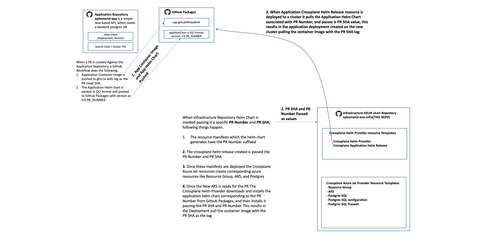

# Ephemeral app - Infrastructure Repo

This is the Infrastructure repository which contains the manifests / templates to provision the cloud services / resources needed for the ephemeral environment creation, when PR is created against [ephemeral-app](https://github.com/maniSbindra/ephemeral-app)

## Overview

Before we look at how the end to solution can work, let us try and understand how the application repo [ephemeral-app](https://github.com/maniSbindra/ephemeral-app), and this Infrastructure Helm Chart Repo work in unision. We will look at a few key events

### Application Repo Pull Request Workflow

When a PR is created Against the Application Repository, a Github Workflow does the following:
* Application Container Image is pushed to ghcr.io with tag as the PR Head SHA
* The Application Helm chart is packed in OCI format and pushed to Github Packages with version as 0.0.PR_NUMBER

### Infrastructure Repo (This Repo) Helm Chart used passing values of PR Number and PR SHA

When Infrastructure Repository Helm Chart is invoked passing it a specific PR Number and PR SHA, following things happen:
* The resource manifests which the helm chart generates have the PR Number suffixed
* There are two kinds of resources which this helm chart generates, Crossplane Azure Jet Provider resources, which create corresponding azure resources, and Crossplane Helm Provider resources. Following is the detail of these resources:
  * [Crossplane Azure Jet Provider](https://github.com/maniSbindra/ephemeral-env-infra/blob/main/ephemeral-env/templates/jet-provider.yaml): This crossplane provider needs access to an Azure service principle, which is supplied to this provider via a kubernetes secret in the crossplane-system namespace (The management [cluster bootstrap script](https://github.com/maniSbindra/ephemeral-mgmt/blob/main/mgmt-server-install/setup-mgmt-cluster.sh) sets this secret) 
  * [Crossplane Jet Azure Resource Group manifest](https://github.com/maniSbindra/ephemeral-env-infra/blob/main/ephemeral-env/templates/rg.yaml): creates an Azure resource group for the PR
  * [Crossplane Jet Azure AKS manifest](): Creates an AKS cluster in the PR specific resource group. The kubeconfig information for this cluster is stored in a secret fmreal-kubeconfig, created in the Ephemeral namespace for the PR, on the management cluster 
  * [Crossplane Postgres SQL database manifest](https://github.com/maniSbindra/ephemeral-env-infra/blob/main/ephemeral-env/templates/pg-sql-server.yaml): Creates a Postgres SQL Database in the PR resource group. This resource needs to be configured with a password for the Postgres admin user. This is configured by referencing a secret created in the crossplane-system namespace during the management [cluster boot strap process](https://github.com/maniSbindra/ephemeral-mgmt/blob/main/mgmt-server-install/setup-mgmt-cluster.sh). 
  * [Crossplane Postgres SQL configuration](https://github.com/maniSbindra/ephemeral-env-infra/blob/main/ephemeral-env/templates/pg-sql-configuration.yaml): Used to change Postgres db configurations
  * [Crossplane Postgres SQL firewall](https://github.com/maniSbindra/ephemeral-env-infra/blob/main/ephemeral-env/templates/pg-sql-fw-rule.yaml): Used to configure firewall rules for access to the Postgres SQL db
  * [Crossplane Helm Provider](https://github.com/maniSbindra/ephemeral-env-infra/blob/main/ephemeral-env/templates/helm-provider.yaml): The Crossplane Helm provider needs to be configured with kubeconfig information for the target Kubernetes cluster. Since the Crossplane Jet Azure AKS  resource creates a secret in the PR's ephemeral namespace, we reference this secret in the Crossplane Helm provider to set the admin password.
  * [Crossplane Helm Release](https://github.com/maniSbindra/ephemeral-env-infra/blob/main/ephemeral-env/templates/helm-release-app.yaml): This releases the application to the AKS cluster created for the PR. This is done by referencing the tag of the application container image, and version of the [application helm chart](https://github.com/maniSbindra/ephemeral-app/tree/main/charts/app) specific to this PR. We need to pass in the Postgres data base (created for this PR) values to the application container. The password is passed in using the Postgres database admin password kubernetes secret, set in the crossplane-system database (as shown in the snippet below)
*  Once these manifests are deployed the Crossplane Azure Jet resources create corresponding azure resources like Resource Group, AKS, and Postgres
* The crossplane application helm release resource created is passed the PR Number and PR SHA
* Once the New AKS is ready for the PR The Crossplane Helm Provider downloads and installs the application helm chart corresponding to the PR Number from Github Packages, and then installs it passing the PR SHA and PR Number. This results in the Application Deployment pulling the container image with the PR SHA as the tag
* If new commit is pushed to the PR, then the only thing which changes is the Crossplane Helm Release for the application, which results in pulling of the latest container image with the new PR Head SHA

## Integration with Application PR flow
The [ephemeral-mgmt](https://github.com/maniSbindra/ephemeral-mgmt) repository currently shows 2 different approaches of how end to end ephmeral environment creation can work for PRs to the application repository.
* The first approach uses Argo CD with ArgoCD ApplicationSet and Pull request Generator
* The second approach uses a sample custom controller along with Flux HelmReleases

